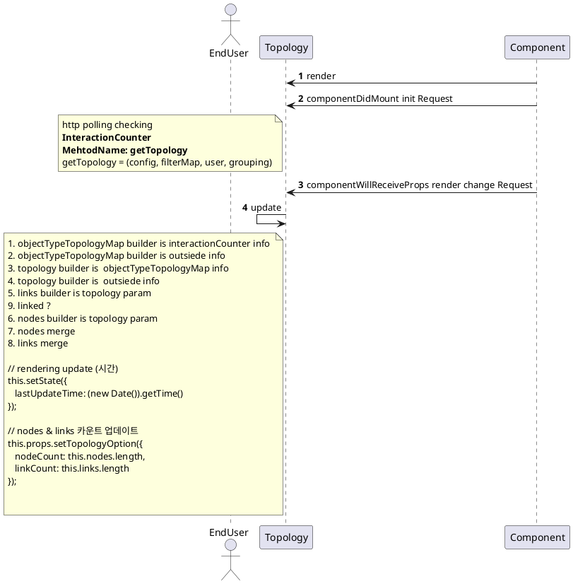

관심사 및 공부 
  - Java 프로파일링 
  - JavaScript 프로파일링 
  - 스파크 실시간 구축 
  - Jmeter 도구 공부 
  - 오픈스택 구축 
  - 음성비서  / 사물 인식 쇼핑 
  - 타임 시리즈 형 시험 대비형 구현 / map db 비슷한 구현

# 

```plantuml
@startuml
actor EndUser

autonumber
Topology <- Component: render
Topology <- Component: componentDidMount init Request
note left of Topology
 http polling checking 
 <b>InteractionCounter 
 <b>MehtodName: getTopology 
 getTopology = (config, filterMap, user, grouping)
end note
Topology <- Component: componentWillReceiveProps render change Request

Topology <- Topology : update
note left of Topology
 1. objectTypeTopologyMap builder is interactionCounter info 
 2. objectTypeTopologyMap builder is outsiede info 
 3. topology builder is  objectTypeTopologyMap info 
 4. topology builder is  outsiede info 
 5. links builder is topology param
 9. linked ?
 6. nodes builder is topology param
 7. nodes merge
 8. links merge
 
 // rendering update (시간)  
 this.setState({
    lastUpdateTime: (new Date()).getTime()
 });
 
 // nodes & links 카운트 업데이트 
 this.props.setTopologyOption({
    nodeCount: this.nodes.length,
    linkCount: this.links.length
 }); 
 
  
end note

@enduml
```
